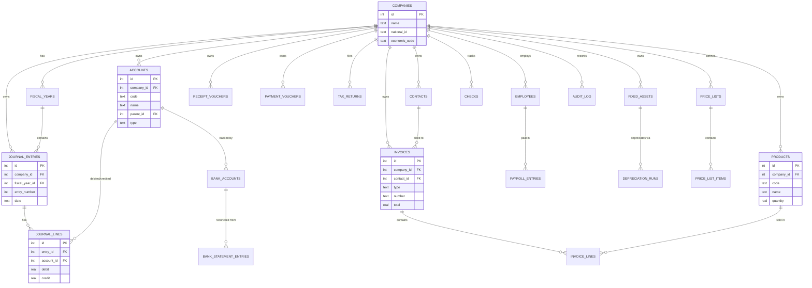

<div dir="rtl" lang="fa">

# حساب‌یار (HesabYar) 🧾
**نرم‌افزار حسابداری دسکتاپ، رایگان و متن‌باز فارسی با Tauri + React + Rust.**

حساب‌یار یک سیستم حسابداری دوطرفه کاملاً آفلاین برای کسب‌وکارهای ایرانی،
مغازه‌داران، فریلنسرها و دفاتر حسابداری است. از پایه فارسی است — چیدمان
راست‌به‌چپ، تقویم جلالی، اعداد فارسی و قالب‌بندی ریال/تومان — و برای همیشه
با مجوز MIT رایگان است.

[English version](./README.md)

<div align="center" dir="ltr">


</div>

---

## فهرست مطالب
- [مرور کلی](#مرور-کلی)
- [چرا حساب‌یار را ساختیم؟](#چرا-حساب‌یار-را-ساختیم)
- [امکانات](#امکانات)
- [پشته فناوری و دلیل انتخاب](#پشته-فناوری-و-دلیل-انتخاب)
- [چرا Rust؟](#چرا-rust)
- [معماری](#معماری)
- [مدل داده](#مدل-داده)
- [تصمیم‌های مهندسی](#تصمیم‌های-مهندسی)
- [امنیت](#امنیت)
- [کارایی](#کارایی)
- [تست](#تست)
- [شروع کار](#شروع-کار)
- [پیکربندی](#پیکربندی)
- [ساختار پروژه](#ساختار-پروژه)
- [CI/CD](#cicd)
- [نقشه راه](#نقشه-راه)
- [مجوز](#مجوز)

---

## مرور کلی

نرم‌افزارهای حسابداری حرفه‌ای در ایران معمولاً پولی و بسته هستند. حساب‌یار یک
برنامه حسابداری کامل و قابل نگهداری است که بدون هیچ سرویس خارجی اجرا می‌شود:
دفتر هر شرکت در یک فایل SQLite محلی روی دستگاه کاربر ذخیره می‌شود؛ بدون ابر،
بدون نیاز به اینترنت و بدون جمع‌آوری اطلاعات.

کد بر اساس **حوزه حسابداری** (حساب‌ها، اسناد، فاکتور، انبار، بانکداری،
مالیات، حقوق…) سازماندهی شده است نه بر اساس لایه فنی؛ هر حوزه دستورات Rust،
کد دسترسی به SQLite و صفحات React خودش را دارد.

---

## چرا حساب‌یار را ساختیم؟

- **رایگان برای همیشه.** هر کسب‌وکاری باید بدون هزینه مجوز، حسابداری واقعی
  داشته باشد. حساب‌یار گردش کار دوطرفه کامل را با مجوز MIT ارائه می‌دهد.
- **فارسی از پایه.** بیشتر ابزارهای حسابداری ترجمه‌شده و ناقص‌اند. حساب‌یار از
  روز اول حول مفاهیم ایرانی طراحی شده: رابط راست‌به‌چپ، تقویم جلالی، اعداد
  فارسی، قالب‌بندی ریال/تومان و مفاهیمی مانند سند روزنامه، تراز آزمایشی، رسید
  دریافت/پرداخت و اظهارنامه.
- **آفلاین و خصوصی.** داده‌ها یک پایگاه‌داده SQLite محلی است — بدون ابر، بدون
  نیاز به اینترنت و بدون جمع‌آوری داده — همراه با پشتیبان‌گیری خودکار.
- **مدرن و سبک.** با فناوری ۲۰۲۵ (Tauri v2، React، Rust) ساخته شده است. چون
  Tauri از مرورگر داخلی سیستم‌عامل استفاده می‌کند، نصب‌کننده چند مگابایت است
  نه حدود ۱۵۰ مگابایت.
- **باز و توسعه‌پذیر.** معماری ماژولار و آماده افزونه؛ حقوق و دستمزد، دارایی
  ثابت، چک و مغایرت بانکی دقیقاً از دل همین معماری رشد کرده‌اند.

---

## امکانات

### حسابداری هسته
- پشتیبانی چندشرکتی با پایگاه‌داده جداگانه برای هر شرکت
- نمودار حساب سلسله‌مراتبی (سطوح نامحدود، انواع و ارز)
- سند روزنامه دوطرفه با کنترل خودکار برابری بدهکار و بستانکار
- دفتر کل و دفتر معین
- تراز آزمایشی (چندستونی با فیلتر بازه تاریخ)
- اسناد افتتاحیه/اختتامیه و مدیریت سال مالی
- قالب‌های اسناد تکرارشونده

### گزارش‌های مالی
- تراز آزمایشی، دفتر کل، ترازنامه، صورت سود و زیان و جریان وجوه نقد
- گزارش‌های مقایسه‌ای دوره‌ای با ستون اختلاف و درصد
- گزارش‌ساز سفارشی
- ماژول بودجه: دوره‌ها، بودجه هر حساب و مقایسه بودجه با عملکرد
- داشبورد با کارت‌های شاخص، نسبت‌های مالی و نمودارهای تعاملی
- خروجی PDF (jspdf + html2canvas) و Excel (SheetJS) با سرستون فارسی

### فروش، خرید و انبار
- اشخاص (مشتری/تأمین‌کننده) با سقف اعتبار و شرایط پرداخت
- فاکتور فروش، خرید و پیش‌فاکتور با تخفیف و مالیات
- تخفیف پرداخت زودهنگام/دیرهنگام
- کاتالوگ کالا با سطح حداقل/حداکثر و نقطه سفارش
- گردش انبار (ورود/خروج/اصلاح)، ارزش‌گذاری میانگین موزون (WAC) و FIFO
- وضعیت موجودی، هشدار کسری کالا و گزارش ارزش موجودی
- لیست قیمت

### بانکداری
- حساب‌های بانکی متصل به حساب‌های دفتر کل
- رسید دریافت و رسید پرداخت
- ایجاد خودکار سند حسابداری برای هر رسید
- مدیریت چک و مغایرت بانکی

### چند ارزی
- مدیریت نرخ ارز و حساب‌های ارزی
- موتور تسعیر ارز خودکار همراه با سوابق

### مالیات و سامانه مودیان
- تنظیمات مالیات بر ارزش افزوده و نرخ مالیات هر کالا
- محاسبه خلاصه مالیات و اظهارنامه‌های مالیاتی (ایجاد/ثبت پرداخت/حذف)
- اتصال به سامانه مودیان و صدور صورتحساب الکترونیکی

### حقوق و دستمزد و دارایی ثابت
- کارکنان، قالب‌های حقوق و آیتم‌های حقوق
- دوره‌های حقوق و ریز پرداختی‌ها
- دفتر دارایی ثابت، خلاصه استهلاک و اجرای استهلاک

### سیستم
- پشتیبان‌گیری تأییدشده و بازیابی امن
- گزارش رویدادها و بازرسی تغییرات
- تنظیمات شرکت، تم روشن/تاریک و رابط راست‌به‌چپ

### کیفیت
- ۸ باینری تست دود Rust (بانکداری، پشتیبان‌گیری، جریان وجوه نقد، ارز، انبار،
  مودیان، مالیات و ماژول‌های جدید)

---

## پشته فناوری و دلیل انتخاب

| لایه | فناوری | چرا |
|------|--------|-----|
| پوسته دسکتاپ | Tauri v2 | پوسته بومی کوچک و سریع؛ استفاده از مرورگر سیستم‌عامل به‌جای Chromium. |
| بک‌اند | Rust | ایمن حافظه، سریع، باینری کوچک؛ صحت در زمان کامپایل برای محاسبات مالی. |
| فرانت‌اند | React 19 + TypeScript + Vite | رابط تایپ‌شده و کامپوننتی با HMR سریع و صفحات code-split. |
| استایل | Tailwind CSS | طراحی سریع، یکدست و راست‌به‌چپ. |
| مدیریت state | Zustand | کمترین boilerplate برای برنامه دسکتاپ تک‌کاربره. |
| نمودار | Chart.js (react-chartjs-2) | نمودارهای مالی بالغ و سازگار با راست‌به‌چپ. |
| جدول | TanStack Table | جدول‌های headless قدرتمند برای گزارش‌ها. |
| فرم | React Hook Form + Zod | فرم‌های اعلانی و اعتبارسنجی‌شده. |
| تاریخ | date-fns-jalali | پردازش صحیح تاریخ جلالی (شمسی). |
| خروجی PDF | jspdf + html2canvas | تبدیل HTML گزارش به PDF. |
| خروجی Excel | xlsx (SheetJS) | خروجی Excel با سرستون فارسی. |
| پایگاه‌داده | SQLite از طریق rusqlite (همراه) | بدون راه‌اندازی؛ فایل DB جدا برای هر شرکت. |
| مهاجرت | فایل‌های SQL نسخه‌بندی‌شده | اسکیمای قابل بازتولید و منظم (`database/migrations/`). |
| HTTP | reqwest + rustls | کلاینت HTTPS ناهمگام برای سامانه مودیان. |
| سریال‌سازی | serde + serde_json | قرارداد JSON تایپ‌شده بین Rust و React. |
| رمزنگاری | rsa, aes-gcm, sha2, pbkdf2, hmac | رمزنگاری/امضا برای پشتیبان‌گیری و مودیان. |

---

## چرا Rust؟

انتخاب Rust برای بک‌اند عمدی است:

- **ایمنی حافظه بدون زباله‌روب (GC).** سیستم مالکیت و Borrow Checker خطاهای
  use-after-free، مسابقه داده و اشاره‌گر تهی را در زمان کامپایل حذف می‌کنند —
  حیاتی برای نرم‌افزاری که با پول سر و کار دارد.
- **کارایی.** انتزاع‌های بدون هزینه و کد بومی، کوئری‌های SQLite، تجمیع
  گزارش‌ها و تسعیر ارز را حتی روی سیستم‌های ضعیف سریع می‌کنند.
- **باینری کوچک و سریع.** در کنار استفاده Tauri از مرورگر بومی، حجم
  نصب‌کننده حدود ۵ مگابایت و اجرای برنامه تقریباً آنی است.
- **صحت در زمان کامپایل.** سیستم نوع قوی Rust دسته‌ی بزرگی از خطاهای زمان
  اجرا را به خطای کامپایل تبدیل می‌کند؛ دقیقاً نیاز منطق حسابداری.
- **همزمانی امن.** کارهای پایگاه‌داده، پشتیبان‌گیری و فراخوانی HTTP مودیان
  بدون خطر حالت مشترک همزمان اجرا می‌شوند.
- **اکوسیستم امتحان‌پس‌داده:** `rusqlite`، `serde`، `reqwest`/`rustls`،
  `rsa`/`aes-gcm`/`pbkdf2`، `chrono` و `uuid`.
- **یک زبان، سه پلتفرم.** همان هسته Rust روی ویندوز، macOS و لینوکس منتشر
  می‌شود.

---

## معماری

یک برنامه دسکتاپ لایه‌ای — عمداً ساده و قابل تست. فرانت‌اند React فقط از طریق
مرز دستورات تایپ‌شده Tauri با بک‌اند Rust صحبت می‌کند و بک‌اند Rust تنها
لایه‌ای است که SQLite را لمس می‌کند.

<div dir="ltr">

```mermaid
flowchart TB
subgraph UI["React + TypeScript frontend"]
P[Pages]
S[Zustand stores]
C[Components]
end
subgraph Core["Rust backend (Tauri v2)"]
CMD[commands/ — Tauri command handlers]
DB[db/ — SQLite data access]
MIG[database/migrations/ SQL]
end
subgraph Ext["External"]
MO[Moadian API]
end
P -->|invoke()| CMD
S --> P
C --> P
CMD --> DB
DB --> MIG
CMD -->|reqwest| MO
```

</div>

### مرزهای ماژول

کد بر اساس **حوزه** سازماندهی شده نه بر اساس لایه. هر حوزه ماژول دستورات
(`src-tauri/src/commands/*.rs`)، ماژول دسترسی داده (`src-tauri/src/db/*.rs`) و
صفحه React خود (`src/pages/*`) را دارد و نگرانی‌های مشترک (چیدمان، اجزای UI،
قالب‌بندی) جدا نگه داشته شده‌اند.

---

## مدل داده

<div dir="ltr">



</div>

اسکیمای کامل در مهاجرت‌های نسخه‌بندی‌شده
(`database/migrations/001_initial.sql` تا `024_backups.sql`) قرار دارد؛ بنابراین
قابل تکامل و بازتولید روی هر دستگاهی است.

---

## تصمیم‌های مهندسی

این تصمیم‌ها یک برنامه حسابداری واقعی را از یک دمو جدا می‌کنند:

1. **حسابداری دوطرفه توسط پایگاه‌داده اعمال می‌شود، نه رابط کاربری.** جدول
   `journal_lines` قیدهای `CHECK` دارد که مبالغ منفی را رد می‌کند و اجازه
   می‌دهد هر سطر فقط یک طرف (بدهکار یا بستانکار) داشته باشد — سند ناسالم هرگز
   نوشته نمی‌شود.
2. **SQLite برای هر شرکت.** هر شرکت یک فایل `.db` قابل حمل است. پشتیبان‌گیری
   کپی فایل است، بازیابی اتمیک است و سروری برای نگهداری وجود ندارد.
3. **اسکیمای نسخه‌بندی‌شده و مستقل از چارچوب.** مهاجرت‌ها SQL خام و مرتب‌اند؛
   اسکیما قابل بازتولید و مستقل از کد Rust است.
4. **ماژول‌های دامنه در هر دو طرف آینه‌اند.** `commands/` و `db/` هم‌نام‌اند
   (`accounts.rs`، `invoices.rs`، `banking.rs` و…)؛ پیدا کردن کد هر قابلیت
   مکانیکی است.
5. **مرز invoke تایپ‌شده و نازک.** `src/lib/tauri.ts` روی
   `@tauri-apps/api/core` لایه نازکی می‌کشد و وقتی runtime دسکتاپ نباشد به یک
   mock مرورگری برمی‌گردد؛ بنابراین UI در `npm run dev` ساده هم رندر می‌شود.
6. **Code splitting در سطح صفحه.** هر صفحه `React.lazy` است؛ باندل اصلی کوچک و
   باز شدن برنامه سریع می‌ماند.
7. **تست‌های دود با feature جدا شده‌اند.** ۸ باینری تست با
   `required-features = ["smoke-tests"]` تعریف شده‌اند؛ در بیلد عادی ساخته
   نمی‌شوند و هرگز داخل باندل برنامه قرار نمی‌گیرند.
8. **راست‌به‌چپ و فارسی در همه‌جا.** تاریخ جلالی، اعداد فارسی و قالب‌بندی
   ریال/تومان در `src/lib/jalali.ts` و `src/lib/persian-number.ts` متمرکز است.
9. **کمترین دسترسی.** allowlist قابلیت‌های Tauri فقط `core:default` و
   `shell:allow-open` را می‌دهد — فرانت‌اند چیز دیگری نمی‌تواند صدا بزند.
10. **NSIS به‌جای MSI.** ابزار WiX 3 نمی‌تواند با نام فارسی محصول نصب‌کننده
    بسازد؛ بنابراین ویندوز از نصب‌کننده `.exe` (NSIS) استفاده می‌کند که
    یونیکد را پشتیبانی می‌کند.

---

## امنیت

- **allowlist صریح قابلیت‌های Tauri** — پنجره فقط مجوزهای تعریف‌شده در
  `capabilities/default.json` را دارد.
- **یکپارچگی در لایه داده** — قیدهای `CHECK` حسابداری دوطرفه و کلیدهای خارجی
  از حالت مالی ناسازگار جلوگیری می‌کنند.
- **داده فقط محلی** — SQLite روی دستگاه کاربر؛ بدون ابر و بدون telemetry.
- **رمزنگاری آماده** — RSA/AES-GCM/PBKDF2 برای داده‌های حساس مانند
  پشتیبان‌گیری و بسته‌های مودیان.
- **بدون secret در سورس** — فایل‌های `.env*` و DB محلی git-ignore شده‌اند.

---

## کارایی

- صفحات lazy و code-split باندل اولیه را کوچک نگه می‌دارند.
- کوئری‌های SQLite ایندکس‌دار (`idx_*`) برای حساب‌ها، تاریخ اسناد، فاکتورها،
  اشخاص و رسیدها.
- تجمیع‌ها و ارزش‌گذاری‌ها در Rust انجام می‌شوند — بدون رفت‌وبرگشت سطر به سطر.
- بدون Chromium همراه؛ مرورگر سیستم‌عامل فوراً اجرا می‌شود.

---

## تست

```bash
cd src-tauri
cargo run --bin banking_smoke_test --features smoke-tests
cargo run --bin backup_smoke_test --features smoke-tests
cargo run --bin cashflow_smoke_test --features smoke-tests
cargo run --bin currency_smoke_test --features smoke-tests
cargo run --bin inventory_smoke_test --features smoke-tests
cargo run --bin moadian_smoke_test --features smoke-tests
cargo run --bin new_modules_smoke_test --features smoke-tests
cargo run --bin tax_smoke_test --features smoke-tests
```

دروازه‌های کیفیت فرانت‌اند: `npm run lint` (oxlint) و `npm run build` (بررسی
TypeScript + ساخت تولید). هر دو همراه `cargo check` در CI اجرا می‌شوند.

---

## شروع کار

### پیش‌نیازها
- **Node.js** نسخه 20.19 یا بالاتر (نسخه 22 پیشنهادی)
- زنجیره‌ابزار **Rust** نسخه stable
- وابستگی‌های سیستمی Tauri v2 برای سیستم‌عامل شما
  ([راهنمای پیش‌نیازها](https://v2.tauri.app/start/prerequisites/))

### توسعه

```bash
npm install

# اجرای برنامه دسکتاپ (Vite + بک‌اند Rust)
npm run tauri dev

# یا فقط فرانت‌اند در مرورگر (Vite روی پورت 1420)
npm run dev
```

### بررسی‌ها

```bash
npm run lint                # oxlint
npm run build               # بررسی TypeScript + ساخت تولید فرانت‌اند
cd src-tauri && cargo check # بررسی Rust
```

---

## پیکربندی

| پلتفرم | اهداف باندل | نصب‌کننده |
|--------|-------------|-----------|
| ویندوز | `nsis` | `حساب‌یار_<version>_x64-setup.exe` |
| macOS   | `app`، `dmg` | `.app` و `.dmg` |
| لینوکس  | `deb`، `rpm`، `appimage` | `.deb`، `.rpm`، `.appimage` |

اهداف باندل در `src-tauri/tauri.conf.json` تنظیم می‌شوند. MSI عمداً غیرفعال
است چون WiX 3 نمی‌تواند نام فارسی محصول را پردازش کند.

---

## ساختار پروژه

```
hesabyar/
├── src/                      # فرانت‌اند React + TypeScript
│   ├── pages/                # یک پوشه برای هر صفحه
│   ├── components/           # چیدمان، اجزای UI، ویزارد و مودال‌ها
│   ├── stores/               # استورهای Zustand
│   ├── lib/                  # رابط Tauri، تاریخ جلالی، قالب‌بندی و خروجی
│   └── types/                # واسط‌های مشترک TypeScript
├── src-tauri/                # بک‌اند Rust (Tauri v2)
│   ├── src/
│   │   ├── commands/         # دستورات Tauri برای هر ماژول
│   │   ├── db/               # لایه دسترسی SQLite برای هر ماژول
│   │   ├── models/           # ساختارهای داده مشترک
│   │   ├── moadian/          # کلاینت سامانه مودیان
│   │   └── bin/              # باینری‌های تست دود (با feature جدا)
│   ├── capabilities/         # allowlist مجوزهای Tauri
│   └── tauri.conf.json       # پیکربندی برنامه و باندل
├── database/migrations/      # مهاجرت‌های SQLite نسخه‌بندی‌شده (001 تا 024)
├── public/                   # فونت‌ها، favicon و آیکون‌ها
├── index.html
├── package.json
└── vite.config.ts
```

---

## CI/CD

- **`.github/workflows/ci.yml`** — روی هر push/PR: oxlint، ساخت TypeScript،
  `cargo check` و `cargo check --features smoke-tests`.
- **`.github/workflows/build-installers.yml`** — نصب‌کننده ویندوز (`.exe` با
  NSIS) و macOS (`.app`/`.dmg` یونیورسال) را می‌سازد، به‌عنوان artifact بارگذاری
  می‌کند و با push تگ `v*` به Release گیت‌هاب متصل می‌کند.

برای انتشار نسخه:

```bash
git tag v0.1.0
git push origin v0.1.0
```

---

## نقشه راه

- [ ] مدیریت کاربران و نقش‌های دسترسی
- [ ] ورود داده از Excel/CSV
- [ ] چاپ حرارتی (ESC/POS)
- [ ] رابط انگلیسی
- [ ] همگام‌سازی/پشتیبان‌گیری ابری اختیاری
- [ ] امضای Windows Authenticode و notarization در macOS
- [ ] تست واحد فرانت‌اند

---

## مجوز

MIT © 2026 [MorTsaedi](https://github.com/MorTsaedi)

</div>
