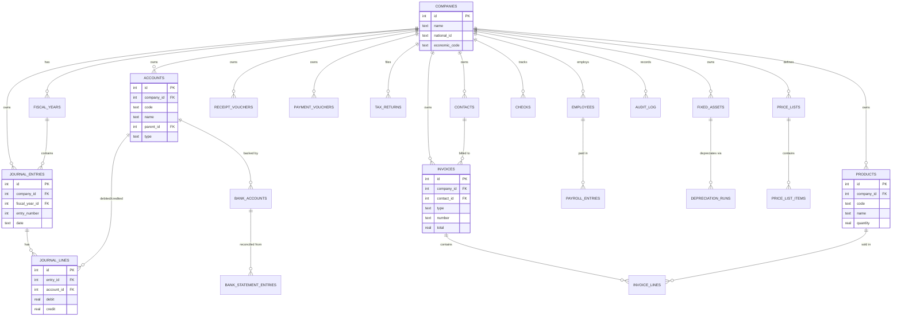

# HesabYar (حساب‌یار) 🧾
**A free, open-source Persian accounting desktop app built with Tauri + React + Rust.**

<p align="center">
  
</p>

HesabYar is a fully offline, double-entry accounting suite for Iranian
businesses, shopkeepers, freelancers and accounting firms. It is Persian from
the ground up — RTL layout, Jalali (Shamsi) dates, Persian numerals and
ریال/تومان formatting — and free forever under the MIT license.

[نسخه فارسی (Persian)](./README.fa.md)

<div align="center">


</div>

---

## Table of contents
- [Overview](#overview)
- [Why we made it](#why-we-made-it)
- [Features](#features)
- [Tech stack & rationale](#tech-stack--rationale)
- [Why Rust?](#why-rust)
- [Architecture](#architecture)
- [Data model](#data-model)
- [Engineering decisions](#engineering-decisions)
- [Security](#security)
- [Performance](#performance)
- [Testing](#testing)
- [Getting started](#getting-started)
- [Configuration](#configuration)
- [Project structure](#project-structure)
- [CI/CD](#cicd)
- [Roadmap](#roadmap)
- [License](#license)

---

## Overview

Professional accounting software in Iran is usually paid and closed-source.
HesabYar is a complete, maintainable accounting application you can run with
**zero external services**: every company's ledger lives in a local SQLite file
on the user's machine, with no cloud, no internet dependency and no telemetry.

The app is organized by accounting domain (accounts, journal, invoices,
inventory, banking, tax, payroll…) rather than by technical layer, so each
domain owns its Rust commands, its SQLite data-access code, and its React
pages — making the system easy to navigate and extend.

---

## Why we made it

- **Free forever.** Every business deserves real accounting without a license
  fee. HesabYar ships the full double-entry workflow under MIT.
- **Persian first.** Most accounting tools are translated afterthoughts.
  HesabYar is designed around Persian conventions from day one: RTL interface,
  Jalali calendar, Persian digits, ریال/تومان formatting, and Iranian concepts
  such as سند روزنامه, تراز آزمایشی, رسید دریافت/پرداخت and اظهارنامه.
- **Offline and private.** Data is a local SQLite database — no cloud, no
  internet dependency, no data collection — with automatic local backup.
- **Modern and lightweight.** Built on 2025 technology (Tauri v2, React, Rust).
  Because Tauri reuses the OS webview instead of bundling Chromium, installers
  are a few megabytes instead of ~150 MB.
- **Open and extensible.** A modular, plugin-ready codebase. Payroll, fixed
  assets, checks and bank reconciliation all grew out of this architecture.

---

## Features

### Core accounting
- Multi-company support with per-company databases and switching
- Hierarchical chart of accounts (unlimited levels, types, currencies)
- Double-entry journal with automatic debit = credit validation
- General ledger and subsidiary ledger
- Trial balance (multi-column, date-range filters)
- Opening/closing entries and fiscal-year management
- Recurring journal entry templates

### Financial reporting
- Trial balance, general ledger, balance sheet, income statement, cash flow
- Period-over-period comparison reports with variance and percentage columns
- Custom report builder
- Budget module: budget periods, per-account entries, budget vs. actual
- Dashboard with KPI cards, financial ratios and interactive charts
- PDF export (jspdf + html2canvas) and Excel export (SheetJS) with Persian headers

### Sales, purchasing & inventory
- Contacts (customers/suppliers) with credit limits and payment terms
- Sales, purchase and proforma invoices with discount and tax
- Early/late payment discounts
- Product catalog with min/max/reorder levels
- Stock movements (in/out/adjustment), WAC and FIFO valuation
- Stock status, low-stock alerts and inventory valuation reports
- Price lists

### Banking
- Bank accounts linked to general-ledger accounts
- Receipt vouchers (رسید دریافت) and payment vouchers (رسید پرداخت)
- Automatic journal entry for every voucher
- Check management (دسته چک) and bank reconciliation (مغایرت بانکی)

### Multi-currency
- Exchange-rate management and foreign-currency accounts
- Automatic currency revaluation engine with history

### Tax & Moadian
- VAT settings and per-product tax rates
- VAT summary computation and tax returns (create / record payment / delete)
- Samane Moadian (سامانه مودیان) e-invoicing integration

### Payroll & fixed assets
- Employees, salary templates and salary items
- Payroll periods and payslip entries
- Fixed-asset register, depreciation summaries and depreciation runs

### System
- Verified backup and safe restore
- Audit trail of changes (بازرسی و رویدادها)
- Company settings, light/dark theme, RTL-first responsive UI

### Quality
- 8 Rust smoke-test binaries (banking, backup, cash flow, currency, inventory,
  Moadian, tax, new modules)

---

## Tech stack & rationale

| Layer | Technology | Why |
|-------|------------|-----|
| Desktop shell | Tauri v2 | Small, fast native shell; reuses the OS webview instead of bundling Chromium. |
| Backend | Rust | Memory-safe, fast, small binaries; compile-time correctness for money math. |
| Frontend | React 19 + TypeScript + Vite | Typed, component-based UI with fast HMR and code-split pages. |
| Styling | Tailwind CSS | Rapid, consistent RTL-aware design system. |
| State | Zustand | Minimal boilerplate for a single-user desktop app. |
| Charts | Chart.js (react-chartjs-2) | Mature, RTL-friendly financial charts. |
| Tables | TanStack Table | Powerful, headless tables for reports and data grids. |
| Forms | React Hook Form + Zod | Declarative, validated forms. |
| Dates | date-fns-jalali | Correct Jalali (Shamsi) date handling. |
| PDF export | jspdf + html2canvas | Render report HTML to PDF. |
| Excel export | xlsx (SheetJS) | Excel export with Persian column headers. |
| Database | SQLite via rusqlite (bundled) | Zero-setup, embedded, per-company DB files. |
| Migrations | Versioned SQL files | Reproducible, ordered schema (`database/migrations/`). |
| HTTP | reqwest + rustls | Async HTTPS client for the Samane Moadian API. |
| Serialization | serde + serde_json | Typed JSON contract between Rust and React. |
| Crypto | rsa, aes-gcm, sha2, pbkdf2, hmac | Encryption/signing for backups and Moadian payloads. |

---

## Why Rust?

The backend is Rust on purpose:

- **Memory safety without a garbage collector.** Ownership and the borrow
  checker eliminate use-after-free, data races and null-pointer bugs at
  compile time — essential for software that handles money.
- **Performance.** Zero-cost abstractions and native code make SQLite queries,
  report aggregation and currency revaluation fast even on low-end machines.
- **Small, fast binaries.** Combined with Tauri's webview reuse, installers
  stay ~5 MB and startup is near-instant — unlike Electron.
- **Correctness at compile time.** Rust's expressive type system turns whole
  classes of runtime errors into compile errors, which is exactly what
  accounting logic needs.
- **Safe concurrency.** Database work, backup and Moadian HTTP calls run
  concurrently without shared-state hazards.
- **A battle-tested ecosystem for this domain:** `rusqlite`, `serde`,
  `reqwest`/`rustls`, `rsa`/`aes-gcm`/`pbkdf2`, `chrono` and `uuid`.
- **One language, three platforms.** The same Rust core ships on Windows,
  macOS and Linux.

---

## Architecture

A layered desktop app — deliberately simple and testable. The React frontend
talks to the Rust backend only through the typed Tauri command boundary, and
the Rust backend is the only thing that touches SQLite.

```mermaid
flowchart TB
subgraph UI["React + TypeScript frontend"]
P[Pages]
S[Zustand stores]
C[Components]
end
subgraph Core["Rust backend (Tauri v2)"]
CMD[commands/ — Tauri command handlers]
DB[db/ — SQLite data access]
MIG[database/migrations/ SQL]
end
subgraph Ext["External"]
MO[Moadian API]
end
P -->|invoke()| CMD
S --> P
C --> P
CMD --> DB
DB --> MIG
CMD -->|reqwest| MO
```

### Package boundaries

The codebase is organized by **domain** rather than by layer. Each domain owns
its Rust command module (`src-tauri/src/commands/*.rs`), its data-access module
(`src-tauri/src/db/*.rs`) and its React page (`src/pages/*`), with shared
cross-cutting concerns (layout, UI primitives, formatting) kept separate.

---

## Data model



The full schema lives in versioned migrations
(`database/migrations/001_initial.sql` … `024_backups.sql`), so it is safe to
evolve and reproduce on any machine.

---

## Engineering decisions

These are the calls that separate a real accounting app from a demo:

1. **Double-entry is enforced by the database, not the UI.** `journal_lines`
   has `CHECK` constraints that require non-negative amounts and exactly one
   side (debit XOR credit) per line — a malformed entry can never be written.
2. **SQLite per company.** Each company is one portable `.db` file. Backups are
   file copies, restore is atomic, and there is no server to maintain.
3. **Versioned, framework-agnostic schema.** Migrations are plain SQL applied
   in order, so the schema is reproducible and independent of the Rust code.
4. **Domain modules, mirrored on both sides.** `commands/` and `db/` mirror
   each other (`accounts.rs`, `invoices.rs`, `banking.rs`, …), so finding the
   code for a feature is mechanical.
5. **A thin, typed invoke boundary.** `src/lib/tauri.ts` wraps
   `@tauri-apps/api/core` and falls back to a browser mock when there is no
   desktop runtime, so the UI still renders in plain `npm run dev`.
6. **Page-level code splitting.** Every page is `React.lazy`, keeping the main
   bundle small and the app fast to open.
7. **Smoke tests are feature-gated.** The 8 smoke-test binaries are declared
   with `required-features = ["smoke-tests"]`, so they are excluded from normal
   builds and never shipped inside the app bundle.
8. **RTL-first, Persian-everywhere.** Jalali dates, Persian numerals and
   ریال/تومان formatting are centralized in `src/lib/jalali.ts` and
   `src/lib/persian-number.ts`.
9. **Least-privilege capabilities.** The Tauri capability allowlist exposes
   only `core:default` and `shell:allow-open` — nothing else the frontend can
   call.
10. **MSI dropped in favor of NSIS.** WiX 3 cannot build installers with the
    Persian product name, so Windows ships an NSIS `.exe` (Unicode-safe).

---

## Security

- **Explicit Tauri capability allowlist** — the window can only use the
  permissions declared in `capabilities/default.json`.
- **Integrity at the data layer** — double-entry `CHECK` constraints and
  foreign keys prevent inconsistent financial state.
- **Local-only data** — SQLite on the user's machine; no cloud, no telemetry.
- **Encryption primitives wired in** — RSA/AES-GCM/PBKDF2 for sensitive data
  such as backups and Moadian payloads.
- **No secrets in source** — `.env*` and local DB files are git-ignored.

---

## Performance

- Lazy, code-split pages keep the initial bundle small.
- Indexed SQLite queries (`idx_*`) for accounts, journal dates, invoices,
  contacts and vouchers.
- Aggregations and valuation runs happen in Rust — no round-trips per row.
- No bundled Chromium; the OS webview starts instantly.

---

## Testing

```bash
cd src-tauri
cargo run --bin banking_smoke_test --features smoke-tests
cargo run --bin backup_smoke_test --features smoke-tests
cargo run --bin cashflow_smoke_test --features smoke-tests
cargo run --bin currency_smoke_test --features smoke-tests
cargo run --bin inventory_smoke_test --features smoke-tests
cargo run --bin moadian_smoke_test --features smoke-tests
cargo run --bin new_modules_smoke_test --features smoke-tests
cargo run --bin tax_smoke_test --features smoke-tests
```

Frontend quality gates: `npm run lint` (oxlint) and `npm run build` (TypeScript
check + production build). Both run in CI along with `cargo check`.

---

## Getting started

### Prerequisites
- **Node.js** 20.19+ (22 recommended)
- **Rust** stable toolchain
- Tauri v2 system dependencies for your OS
  ([prerequisites guide](https://v2.tauri.app/start/prerequisites/))

### Development

```bash
npm install

# Run the desktop app (Vite + Rust backend)
npm run tauri dev

# Or run only the frontend in the browser (Vite on port 1420)
npm run dev
```

### Checks

```bash
npm run lint                # oxlint
npm run build               # TypeScript check + production frontend build
cd src-tauri && cargo check # Rust check
```

---

## Configuration

| Platform | Bundle targets | Installer |
|----------|----------------|-----------|
| Windows  | `nsis` | `حساب‌یار_<version>_x64-setup.exe` |
| macOS    | `app`, `dmg` | `.app` and `.dmg` |
| Linux    | `deb`, `rpm`, `appimage` | `.deb`, `.rpm`, `.appimage` |

Bundle targets are configured in `src-tauri/tauri.conf.json`. MSI is
intentionally disabled because WiX 3 cannot handle the Persian product name.

---

## Project structure

```
hesabyar/
├── src/                      # React + TypeScript frontend
│   ├── pages/                # one folder per feature page
│   ├── components/           # layout, UI primitives, wizard, modals
│   ├── stores/               # Zustand stores
│   ├── lib/                  # Tauri wrapper, Jalali/Persian format, export
│   └── types/                # shared TypeScript interfaces
├── src-tauri/                # Rust backend (Tauri v2)
│   ├── src/
│   │   ├── commands/         # Tauri command handlers per module
│   │   ├── db/               # SQLite data-access layer per module
│   │   ├── models/           # shared data structures
│   │   ├── moadian/          # Samane Moadian client
│   │   └── bin/              # smoke-test binaries (feature-gated)
│   ├── capabilities/         # Tauri permission allowlist
│   └── tauri.conf.json       # app + bundle configuration
├── database/migrations/      # versioned SQLite migrations (001 … 024)
├── public/                   # fonts, favicon, icons
├── index.html
├── package.json
└── vite.config.ts
```

---

## CI/CD

- **`.github/workflows/ci.yml`** — on every push/PR: oxlint, TypeScript build,
  `cargo check`, and `cargo check --features smoke-tests`.
- **`.github/workflows/build-installers.yml`** — builds Windows (NSIS `.exe`)
  and macOS (universal `.app`/`.dmg`) installers, uploads them as workflow
  artifacts, and attaches them to a GitHub Release when you push a `v*` tag.

To ship a release:

```bash
git tag v0.1.0
git push origin v0.1.0
```

---

## Roadmap

- [ ] User management & role-based permissions
- [ ] Data import from Excel/CSV
- [ ] Thermal (ESC/POS) receipt printing
- [ ] English UI option
- [ ] Optional cloud sync / backup
- [ ] Windows Authenticode signing and macOS notarization
- [ ] Frontend unit tests

---

## License

MIT © 2026 [MorTsaedi](https://github.com/MorTsaedi)
